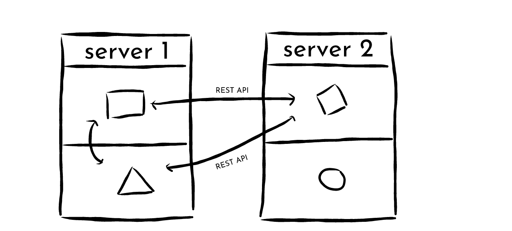

# Giới thiệu về Microservice - Docker - Kubernetes (Phần 1)

Chào mừng các bạn đến với bài viết đầu tiên của mình. Trong bài này, mình sẽ trình bày một cách tổng quan và đơn giản về việc phát triển và triển khai phần mềm, và cách mà chúng đã được thay đổi trong những năm vừa qua nhờ vào sự ra đời của những công nghệ như [Docker](https://www.docker.com/) và [Kubernetes](https://kubernetes.io/)

Chúng ta sẽ bắt đầu bằng một khái niệm cơ bản: **Micro-service**
Trước đây, quá trình phát triển phần mềm được tiến hành theo phương án nguyên khối (**Monolithic**), có thể mường tượng nó như thế này

Mỗi ứng dụng sẽ bao gồm nhiều thành phần con, tất cả tạo nên một thực thể ứng dụng duy nhất. Vì thế, việc thay đổi một thành phần con trong ứng dụng thường dẫn tới việc phải thay đổi lại cấu trúc của toàn bộ ứng dụng. Điều này sẽ rất khó với một ứng dụng có độ phức tạp lớn, với quy mô lên đến cả ngàn hay chục ngàn dòng lệnh. Một khó khăn hiển nhiên khác đó là với một khối chương trình duy nhất như vậy, bạn thường sẽ phải phụ thuộc vào một ngôn ngữ nhất định
 
Để khắc phục điều này, người ta đã nghĩ ra cách phát triển các dịch vụ con (**micro-services**). Mỗi dịch vụ con chạy một chức năng riêng biệt, đượcp phát triển và triển khai độc lập với nhau, giao tiếp với nhau thông qua API để tạo nên một ứng dụng hoàn chỉnh. Về cơ bản, bạn có thể mường tượng nó như thế này:

Bạn có thể dễ thấy ưu điểm của cách triển khai này như sau:
- Các thay đổi trong tính năng của từng dịch vụ thành phần sẽ không làm ảnh hưởng (hoặc ảnh hưởng rất ít) đến các thành phần khác
- Việc thay đổi quy mô (scale) của từng dịch vụ cũng vậy
- Mỗi micro-service có thể được phát triển bằng ngôn ngữ và framework riêng biệt phù hợp

Đương nhiên, micro-services không phải là không đi cùng với những hạn chế của nó. Những thách thức đối với phương án "chia để trị" này gồm có:
- Việc triển khai các dịch vụ thành phần sẽ trở nên phức tạp hơn, đặc biệt khi số lượng thành phần tăng lên (mình nên đặt thành phần này ở server nào? Cách cấu hình các liên kết giữa các thành phần?)
- Việc triển khai các micro-service riêng biệt bên trong cùng một môi trường, như ta thấy ở từng server ở trên, thường sẽ dẫn đến các xung đột về thư viện của môi trường, vì mỗi micro-service được phát triển độc lập. Nó giống như việc bạn build 1 ứng dụng trong trên một máy linux cài đặt python3, nhưng phải triển khai nó một máy chủ chỉ được cài đặt python2 vậy. Vì thế, sẽ tốt hơn nếu mỗi micro-service được phát triển, đóng gói và triển khai trong cùng một môi trường

Điều này đã dẫn đến sự ra đời của công nghệ **Container**

Container được tạo ra với mục đích: đóng gói tất cả ứng dụng và môi trường phát triển của nó (thư viện, các file thực thi(bin),...) thành một khối duy nhất. Nó giống như một khối container to đùng mà bạn thường thấy ở bến cảng, bên trong đó chứa những hàng hóa cần thiết để xuất khẩu (có lẽ đây là nguồn gốc của cái tên container chăng, mình đoán vậy)

*(còn tiếp...)*
