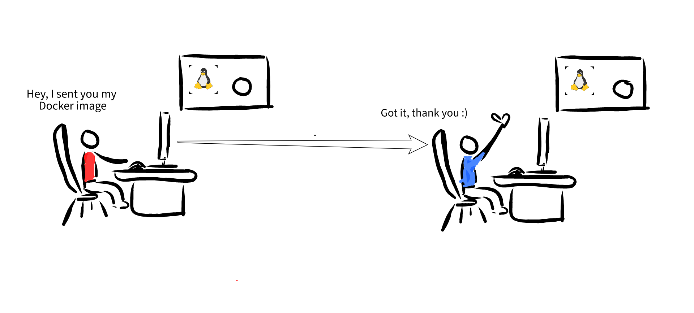

# Giới thiệu về Microservice - Docker - Kubernetes (Phần 3)

Docker là một trong những nền tảng đầu tiên được phát triển với mục đích tận dụng sức mạnh của công nghệ Container, khiến cho việc sử dụng container trở nên đơn giản trên các máy tính khác nhau. Tại sao lại là trên các máy tính khác nhau? Đơn giản vì, khi bạn đóng gói các container bằng Docker, Docker trên các máy tính khác nhau sẽ đều thấy một container chứa những nội dung như nhau. Hình dung cho đơn giản, giống như một thùng container chở hàng vậy, dù có được vận chuyển đi đâu, thì những hàng hóa bên trong vẫn là cố định (tất nhiên, trừ khi bạn vận chuyển kem nhưng quên bảo quản đúng cách :icecream:)

Công nghệ máy ảo (Virtual Machine), như đã đề cập ở phần trước, có khả năng làm điều tương tự: đóng gói tất cả thành một khối (image) duy nhất, và những gì được chữa bên trong như hệ điều hành và các ứng dụng có thể được di chuyển đi mọi nơi. Nhưng Docker (hay Container) làm điều này một cách đơn giản và hiệu quả hơn nhiều. Để có một sự so sánh cụ thể, bạn có thể xem lại phần 2 của loạt bài này nhé.

## Hiểu những khái niệm trong Docker

Docker có khả năng đóng gói rất mạnh mẽ: bạn có thể đóng gói một ứng dụng nhỏ (một web app giúp dự báo thời tiết chẳng hạn), hoặc bạn cũng có thể đóng gói cả một hệ thống file của một hệ điều hành. Nếu không tin, bạn có thể truy cập Docker Hub (https://hub.docker.com). Tại đây, chúng ta có thể dễ dàng tìm được rất nhiều image đã được đóng gói và phân phối rộng rãi (và tất nhiên là miễn phí!) của những phần mềm hay hệ điều hành nổi tiếng (hình bên dưới)

