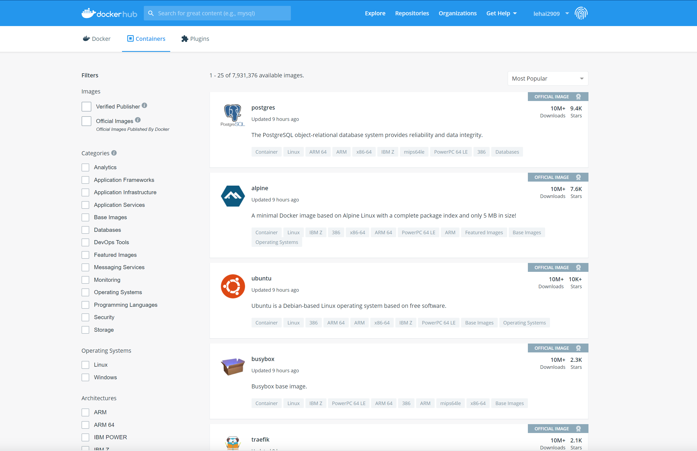

[Về lại trang chủ](https://lehai2909.github.io)
# Giới thiệu về Micro-service - Docker - Kubernetes (Phần 3)

Docker là một trong những nền tảng đầu tiên được phát triển với mục đích tận dụng sức mạnh của công nghệ Container, khiến cho việc sử dụng container trở nên đơn giản trên các máy tính khác nhau. Tại sao lại là trên các máy tính khác nhau? Đơn giản vì, khi bạn đóng gói các container bằng Docker, Docker trên các máy tính khác nhau sẽ đều thấy một container chứa những nội dung như nhau. Hình dung cho đơn giản, giống như một thùng container chở hàng vậy, dù có được vận chuyển đi đâu, thì những hàng hóa bên trong vẫn là cố định (tất nhiên, trừ khi bạn vận chuyển kem nhưng quên bảo quản đúng cách :icecream:)

Công nghệ máy ảo (Virtual Machine), như đã đề cập ở phần trước, có khả năng làm điều tương tự: đóng gói tất cả thành một khối (image) duy nhất, và những gì được chữa bên trong như hệ điều hành và các ứng dụng có thể được di chuyển đi mọi nơi. Nhưng Docker (hay Container) làm điều này một cách đơn giản và hiệu quả hơn nhiều. Để có một sự so sánh cụ thể, bạn có thể xem lại phần 2 của loạt bài này nhé.

## Hiểu những khái niệm trong Docker

Docker có khả năng đóng gói rất mạnh mẽ: bạn có thể đóng gói một ứng dụng nhỏ (một web app giúp dự báo thời tiết chẳng hạn), hoặc bạn cũng có thể đóng gói cả một hệ thống file của một hệ điều hành. Nếu không tin, bạn có thể truy cập Docker Hub (https://hub.docker.com). Tại đây, chúng ta có thể dễ dàng tìm được rất nhiều image đã được đóng gói và phân phối rộng rãi (và tất nhiên là miễn phí!) của những phần mềm hay hệ điều hành nổi tiếng (hình bên dưới)

Docker Hub là một dạng **Registry**. Khái niệm này được định nghĩa trong tài liệu của Docker (https://docs.docker.com/registry/) như sau:

`The Registry is a stateless, highly scalable server side application that stores and lets you distribute Docker images`

Cho dễ hiểu, Registry là một ứng dụng cho phép việc lưu trữ và phân phối Docker image. Docker khuyến khích việc sử dụng Docker Hub giống như một ngân hàng để tìm kiếm những image cần thiết và lưu trữ chúng, vì nó hoàn toàn có sẵn và có thể sử dụng dễ dàng mà không yêu cầu các công việc cài đặt phức tạp.

Bên cạnh Docker Hub, một vài dịch vụ Registry phổ biến khác có thể kể đến:

- Google Container Registry
- Amazon Elastic Container Registry

Về cơ bản chúng là giống nhau, chỉ là được cung cấp bởi các nhà cung cấp dịch vụ điện toán đám mây khác nhau.

Một vài khác niệm quan trọng khác bạn cũng cần hiểu và phân biệt rõ trong Docker:

- **Image**: như đã đề cập (quá nhiều lần :weary:), đây là kết quả cuối cùng khi bạn đóng gói ứng dụng và những thư viện liên quan
- **Container**: là kết quả của quá trình khởi chạy Docker image ở trên. Một container là một quá trình được chạy trên môi trường Docker, nhưng được tách biệt hoàn toàn với môi trường này cũng như các quá trình khác
