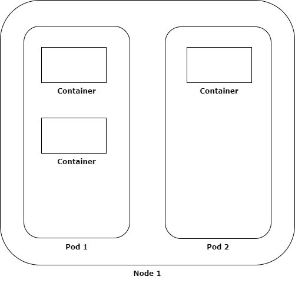

# Giới thiệu về Micro-service - Docker - Kubernetes (Phần 5)
# Kiến trúc tổng quan của Kubernetes

Bắt đầu từ phần này, mình sẽ trình bày những phần đi sâu hơn về kiến trúc của Kubernetes, các thành phần trong một cụm Kubernetes và chức năng của chúng. Đương nhiên, để hiểu tường tận về cấu trúc bên dưới của một nền tảng phức tạp như K8S là một điều rất khó. Vậy nên, mình chỉ xin chia sẻ những hiểu biết của mình ở mức high-level, và hi vọng những kiến thức này sẽ giúp ích cho những người mới làm quen với K8S như mình hồi đó

Bắt đầu nhé !!!

## Kiến trúc tổng quan của một cụm K8S

Khi nói về việc triển khai Kubernetes, tức là chúng ta đang tạo ra một cụm Kubernetes (Kubernetes cluster). Một Kubernetes cluster hoàn chỉnh sẽ bao gồm nhiều máy tính thợ (worker machine), và một trung tâm điểu khiển - gọi là Control Plane. Mình sẽ giới thiệu kĩ hơn về các thành phần này ở phía sau, nhưng về cơ bản, kiến trúc này giống như một mô hình Master-Slaver thông thường trong đó:
- Các Worker machine (gọi là các node trong cluster) phụ trách việc chạy các ứng dụng được đóng gói (đóng vai trò như Slaver)
- Control Plane phụ trách việc quản lý và điều hành toàn bộ cluster (đóng vai trò như Master)

Bạn có thể tham khảo kiến trúc tổng quan này bên dưới

*Các thành phần của Kubernetes (nguồn: kubernetes.io)*

## Các thành phần của một Node trong K8S cluster

Một Node là một máy tính giúp chạy các ứng dụng đóng gói trên K8S. Như bạn vẫn còn nhớ, Kubernetes là nền tảng cho phép quản lý các container ứng dụng một cách tự động. Trong Kubernetes cluster, các container này được đặt trong các [Pod](https://kubernetes.io/docs/concepts/workloads/pods/), và các Pod này chạy trên các Node. 

Mình sẽ giải thích kĩ hơn về khái niệm Pod trong những phần tiếp theo (tránh trường hợp người đọc bị ngộ độc thuật ngữ mới), nhưng về cơ bản, Pod sẽ bao gồm 1 hoặc nhiều container được chay trong một môi trường chung (shared context). Đơn giản là, thay vì việc bạn chạy các container trực tiếp bên trong Node, bạn sẽ bỏ chúng vào các Pod, nơi chúng sẽ cùng chia sẻ tài nguyên. Vậy nên, **Pod được coi là đơn vị tính toán nhỏ nhất trong Kubernetes mà bạn có thể quản lý**, chứ không phải là từng container riêng nhé.

Các thành phần chính trong một Node gồm có:

- **kubelet**: là phần mềm giúp đảm bảo việc các container sẽ được chay trong các Pod
- **kube-proxy**: quản lý các nguyên tắc truy cập mạng đến các Pod, từ bên trong hoặc bên ngoài cluster
- **Container runtime**: là phần mềm hỗ trợ việc chạy các container - một vd tiêu biểu là Docker

## Các thành phần của Control Plane trong K8S cluster

Như mình đã nói sơ qua ở trên, Control Plane phụ trách việc điều hành toàn bộ cluster, trong đó bao gồm việc quản lý các Node cũng như các Pod. Control Plane thường được chạy ở một máy tính riêng để tránh chạy chung với container của người dùng

Các thành phần chính của Control Plane bao gồm:

- **kube-apiserver**: được coi là "giao diện" của Control Plane. Các thành phần bên ngoài giao tiếp với Control Plane thông qua API được đưa ra bởi apiserver
- **etcd**: là một dạng key-value store, kho lưu trữ toàn bộ dữ liệu của cluster
- **kube-scheduler**: là bộ phận giám sát của Pod mới được khởi tạo mà được được chỉ định Node, và sắp xếp Node để đặt các Pod này vào
- **kube-controller-manager**: giúp chạy các quá trình điều khiển ([controller](https://kubernetes.io/docs/concepts/architecture/controller/))

Ngoài ra, một K8S cluster còn có các phần bổ sung khác, như DNS hoặc UI Dashboard.

Trong bài tiếp theo, mình sẽ đi sâu hơn vào chức năng cụ thể của các thành phần, cũng như quá trình chúng tương tác với nhau khi làm việc. 
