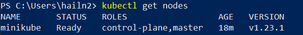

# Giới thiệu về Micro-service - Docker - Kubernetes (Phần 6)


*Lưu ý về các phần mềm cơ bản cần thiết để follow phần này*

Để tìm hiểu về Kiến trúc của K8S, bạn sẽ cần cài đặt một số phần mềm cơ bản sau:

- [minikube](https://minikube.sigs.k8s.io/docs/start/), một phần mềm giúp khởi tạo một K8S cluster chạy nội bộ trên máy tính (gồm các hệ điều hành MacOS, Linux hay Windows). minikube cho phép khởi tạo cluster với chỉ **một** node (Master-node) và không có các worker-node. Vì vậy, Minikube chỉ phù hợp cho việc học và thử nghiệm cơ bản về Kubernetes

- [kubectl](https://kubernetes.io/docs/tasks/tools/install-kubectl-windows/), một chương trình giúp quản lý Kubernetes cluster. Cũng giống minikube, kubectl cũng có thể được sử dụng trên nhiều hệ điều hành


---------------------------------------------------------------


Như mình đã đề cập từ phần trước, Node là nơi đặt và vận hành các container ứng dụng (chính xác thì các container được đặt trong các Pod, và Pod được đặt bên trong Node). Node được quản lý bởi **Control Plane**

Các thành phần chính trong một Node gồm có:

- **kubelet**: là phần mềm giúp đảm bảo việc các container sẽ được chay trong các Pod
- **kube-proxy**: quản lý các nguyên tắc truy cập mạng đến các Pod, từ bên trong hoặc bên ngoài cluster
- **Container runtime**: là phần mềm hỗ trợ việc chạy các container - một vd tiêu biểu là Docker


*(Nguồn: kubernetes.io)*

## Quản lý Node trong Kubernetes

Có 2 cách để khai báo Node trong Kubernetes:

- **kubelet** của Node sẽ tự khai báo với API Server
- Người dùng tự tạo và thêm Node object

Vd, người dùng có thể tạo một Node bằng một khai báo JSON như sau:

```
{
  "kind": "Node",
  "apiVersion": "v1",
  "metadata": {
    "name": "10.240.79.157",
    "labels": {
      "name": "my-first-k8s-node"
    }
  }
}
```

Kubernetes sẽ kiểm tra để xem liệu một kubelet nào đó đã đăng ký tên Node này (metadata.name) với API Server hay chưa, nếu chưa thì việc khai báo Node mới mới được thực thi. Bạn cần lưu ý rằng, trong Kubernetes, tên Node là cách định danh của Node, vậy nên sẽ không thể có 2 Node với tên giống nhau nhé.

## Các thông tin về trạng thái của Node

Trạng thái của Node sẽ bao gồm những thông tin sau:
- Địa chỉ IP 
- Tình trạng Node (condition)
- Tài nguyên và khả năng phân bổ
- Thông tin chung 

Bạn có thể dùng trình dòng lệnh **kubectl** để kiểm tra các thông tin trạng thái của Node:

```
kubectl describe node <insert-node-name-here>
```

Ví dụ như ở đây trên máy tính Windows của mình, mình sử dụng lệnh sau để kiểm tra các node hiện tại trong cluster:

```
kubectl get nodes
```

Kết quả, kubectl trả về hiện tại mình chỉ có một node duy nhất (master) tên là `minikube`



Để xem cụ thể tất cả thông tin về trạng thái của node này, mình sử dụng câu lệnh sau:

```
kubectl describe nodes minikube
```

Câu lệnh này trả về thông tin về node `minikube` trên máy tính cá nhân của mình, cụ thể như sau:

```
C:\Users\hailn2>kubectl describe nodes minikube
Name:               minikube
Roles:              control-plane,master
Labels:             beta.kubernetes.io/arch=amd64
                    beta.kubernetes.io/os=linux
                    kubernetes.io/arch=amd64
                    kubernetes.io/hostname=minikube
                    kubernetes.io/os=linux
                    minikube.k8s.io/commit=3e64b11ed75e56e4898ea85f96b2e4af0301f43d
                    minikube.k8s.io/name=minikube
                    minikube.k8s.io/updated_at=2022_03_13T09_18_07_0700
                    minikube.k8s.io/version=v1.25.1
                    node-role.kubernetes.io/control-plane=
                    node-role.kubernetes.io/master=
                    node.kubernetes.io/exclude-from-external-load-balancers=
Annotations:        kubeadm.alpha.kubernetes.io/cri-socket: /var/run/dockershim.sock
                    node.alpha.kubernetes.io/ttl: 0
                    volumes.kubernetes.io/controller-managed-attach-detach: true
CreationTimestamp:  Sun, 30 Jan 2022 10:02:05 +0700
Taints:             <none>
Unschedulable:      false
Lease:
  HolderIdentity:  minikube
  AcquireTime:     <unset>
  RenewTime:       Sun, 13 Mar 2022 09:23:55 +0700
Conditions:
  Type             Status  LastHeartbeatTime                 LastTransitionTime                Reason                       Message
  ----             ------  -----------------                 ------------------                ------                       -------
  MemoryPressure   False   Sun, 13 Mar 2022 09:23:13 +0700   Sun, 30 Jan 2022 10:20:21 +0700   KubeletHasSufficientMemory   kubelet has sufficient memory available
  DiskPressure     False   Sun, 13 Mar 2022 09:23:13 +0700   Sun, 30 Jan 2022 10:20:21 +0700   KubeletHasNoDiskPressure     kubelet has no disk pressure
  PIDPressure      False   Sun, 13 Mar 2022 09:23:13 +0700   Sun, 30 Jan 2022 10:20:21 +0700   KubeletHasSufficientPID      kubelet has sufficient PID available
  Ready            True    Sun, 13 Mar 2022 09:23:13 +0700   Sun, 13 Mar 2022 09:18:07 +0700   KubeletReady                 kubelet is posting ready status
Addresses:
  InternalIP:  192.168.49.2
  Hostname:    minikube
Capacity:
  cpu:                8
  ephemeral-storage:  263174212Ki
  hugepages-1Gi:      0
  hugepages-2Mi:      0
  memory:             6283768Ki
  pods:               110
Allocatable:
  cpu:                8
  ephemeral-storage:  263174212Ki
  hugepages-1Gi:      0
  hugepages-2Mi:      0
  memory:             6283768Ki
  pods:               110
System Info:
  Machine ID:                 8de776e053e140d6a14c2d2def3d6bb8
  System UUID:                8de776e053e140d6a14c2d2def3d6bb8
  Boot ID:                    82c017a0-0fa7-4277-bb2e-6d3665089d68
  Kernel Version:             5.10.16.3-microsoft-standard-WSL2
  OS Image:                   Ubuntu 20.04.2 LTS
  Operating System:           linux
  Architecture:               amd64
  Container Runtime Version:  docker://20.10.12
  Kubelet Version:            v1.23.1
  Kube-Proxy Version:         v1.23.1
PodCIDR:                      10.244.0.0/24
PodCIDRs:                     10.244.0.0/24
Non-terminated Pods:          (7 in total)
  Namespace                   Name                                CPU Requests  CPU Limits  Memory Requests  Memory Limits  Age
  ---------                   ----                                ------------  ----------  ---------------  -------------  ---
  kube-system                 coredns-64897985d-ghf59             100m (1%)     0 (0%)      70Mi (1%)        170Mi (2%)     41d
  kube-system                 etcd-minikube                       100m (1%)     0 (0%)      100Mi (1%)       0 (0%)         41d
  kube-system                 kube-apiserver-minikube             250m (3%)     0 (0%)      0 (0%)           0 (0%)         41d
  kube-system                 kube-controller-manager-minikube    200m (2%)     0 (0%)      0 (0%)           0 (0%)         41d
  kube-system                 kube-proxy-pjxmk                    0 (0%)        0 (0%)      0 (0%)           0 (0%)         41d
  kube-system                 kube-scheduler-minikube             100m (1%)     0 (0%)      0 (0%)           0 (0%)         41d
  kube-system                 storage-provisioner                 0 (0%)        0 (0%)      0 (0%)           0 (0%)         41d
Allocated resources:
  (Total limits may be over 100 percent, i.e., overcommitted.)
  Resource           Requests    Limits
  --------           --------    ------
  cpu                750m (9%)   0 (0%)
  memory             170Mi (2%)  170Mi (2%)
  ephemeral-storage  0 (0%)      0 (0%)
  hugepages-1Gi      0 (0%)      0 (0%)
  hugepages-2Mi      0 (0%)      0 (0%)
Events:
  Type    Reason                   Age                    From        Message
  ----    ------                   ----                   ----        -------
  Normal  Starting                 5m56s                  kube-proxy
  Normal  NodeHasNoDiskPressure    6m13s (x3 over 6m13s)  kubelet     Node minikube status is now: NodeHasNoDiskPressure
  Normal  NodeHasSufficientPID     6m13s (x3 over 6m13s)  kubelet     Node minikube status is now: NodeHasSufficientPID
  Normal  NodeAllocatableEnforced  6m13s                  kubelet     Updated Node Allocatable limit across pods
  Normal  Starting                 6m13s                  kubelet     Starting kubelet.
  Normal  NodeHasSufficientMemory  6m12s (x4 over 6m13s)  kubelet     Node minikube status is now: NodeHasSufficientMemory
  Normal  Starting                 5m58s                  kubelet     Starting kubelet.
  Normal  NodeHasSufficientMemory  5m57s                  kubelet     Node minikube status is now: NodeHasSufficientMemory
  Normal  NodeHasSufficientPID     5m57s                  kubelet     Node minikube status is now: NodeHasSufficientPID
  Normal  NodeNotReady             5m57s                  kubelet     Node minikube status is now: NodeNotReady
  Normal  NodeHasNoDiskPressure    5m57s                  kubelet     Node minikube status is now: NodeHasNoDiskPressure
  Normal  NodeAllocatableEnforced  5m57s                  kubelet     Updated Node Allocatable limit across pods
  Normal  NodeReady                5m57s                  kubelet     Node minikube status is now: NodeReady
```

Mình sẽ giải thích cơ bản những thông tin về trạng thái của Node ngay sau đây

### Địa chỉ IP (Addresses)

Địa chỉ của Node bao gồm các trường cơ bản như sau:
- Hostname: là tên được khai báo bởi node, ở đây là `minikube`
- ExternalIP: địa chỉ IP của node mà có thể được định tuyến từ bên ngoài của cluster
- InternalIP: địa chỉ IP của node mà chỉ có thể được định tuyến bên trong cluster

### Tình trạng Node (Conditions)

Mô tả trạng thái của tất cả các Node đang chạy trên clusterl. Một vài tình trạng ví dụ:
- Ready: nếu có giá trị True, nghĩa là Node này vẫn chạy bình thường, và sẵn sàng để khởi chạy các pod trong nó
- MemoryPressure: nếu nhận giá trị True, nghĩa là Node hiện tại đang trong tình trạng thiếu bộ nhớ
- ....

### Tài nguyên (Capacity & Allocatable)

Mô tả tất cả các tài nguyên khả dụng trên Node: CPU, bộ nhớ, số lượng pod tối đa có thể được khởi tạo. Với trường hợp của mình ở phía trên, Node của mình hiện tại có 8 CPU, và có thể khởi tạo tối đa 110 pod.

### Thông tin chung (Info)

Mô tả những thông tin chung về Node như là phiên bản kernel, OS Image, hệ điều hành mà Node chạy trên, môi trường Container (docker),....


